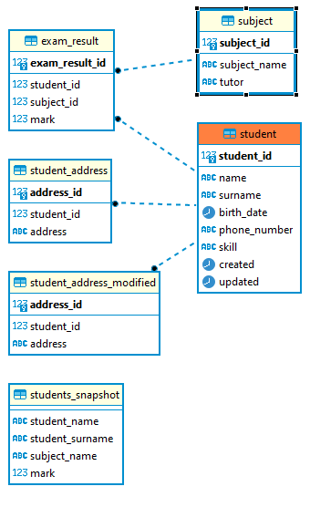

# Module 17 - Databases & Module 7 Advanced SQL

Database scheme analyze and functions for homework

## Homework

### Main task

Chosen database is PostgreSQL

Database creation at 0_create_database.sql file.

Database scheme sql files stored in [sql] directory. These files can be use for flyway database version control.
Example configuration file at cdp_program.conf

#### notes for SQL scripts
1. if you get struggle in fill scripts you can "DELIMITER //" at the first line to test the script

#### index analyze
Documentation of analyze at `task\analysis.docx`

#### Database design
Design at `task\design.PNG`  

### Test queries
#### Module 17 - Databases

Test queries at task/Test queries

a. Find user by name (exact match)  
[a_find_user_by_name_exact_match.sql](tasks/Test%20queries/a_find_user_by_name_exact_match.sql)

b. Find user by surname (partial match)  
[b_find_user_by_surname_partial_match.sql](tasks/Test%20queries/b_find_user_by_surname_partial_match.sql)

c. Find user by phone number (partial match)
[c_find_user_by_phonenumber_partial_match.sql](tasks/Test%20queries/c_find_user_by_phonenumber_partial_match.sql)

d. Find user with marks by user surname (partial match)  
[d_find_user_with_marks_by_user_surname_partial_match.sql](tasks/Test%20queries/d_find_user_with_marks_by_user_surname_partial_match.sql)  

5. Add trigger that will update column updated_datetime to current date in case of updating any of student  
[V1.8__trigger_student_update.sql](sql/V1.8__trigger_student_update.sql)

6. Add validation on DB level that will check username on special characters (reject student name with next characters '@', '#', '$').
[V1.9__add_student_name_rule.sql](sql/V1.9__add_student_name_rule.sql)  
7. Create snapshot that will contain next data: student name, student surname, subject name, mark (snapshot means that in case of changing some data in source table – your snapshot should not change).  
[V1.10__create_snapshot_stundents_and_marks.sql](sql/V1.10__create_snapshot_stundents_and_marks.sql)  
8. Create function that will return average mark for input user.  
[V1.11__function_avg_user_mark.sql](sql/V1.11__function_avg_user_mark.sql)  
9. Create function that will return avarage mark for input subject name.  
[V1.12__function_avg_mark_of_subject.sql](sql/V1.12__function_avg_mark_of_subject.sql)  
10. Create function that will return student at "red zone" (red zone means at least 2 marks <=3).  
[V1.13__function_red_zone.sql](sql/V1.13__function_red_zone.sql)  
11. Show in tests (java application) transaction isolation phenomena. Describe what kind of phenomena is it and how did you achieve it.
- Some test at [database_application]
- test can run by maven (`mvn test` command in module_17\database_application)
12. Implement immutable data trigger. Create new table student_address. Add several rows with test data and do not give acces to update any information inside it. Hint: you can create trigger that will reject any update operation for target table, but save new row with updated (merged with original) data into separate table.  
- Table create: [V1.14__student_address.sql](sql/V1.14__student_address.sql)  
- Fill address table: [V1.15__fill_student_address.sql](sql/V1.15__fill_student_address.sql)  
- Trigger: [16__student_address_modified.sql](sql/V1.16__student_address_modified.sql)  

#### Module 7 - Advanced SQL
All queries in one SQL script: [Moldule_7_Advanced_SQL_queries.sql](Moldule_7_Advanced_SQL_queries.sql)

## Setup HOWTO for flyway database version control
1. Download and install PostgreSQL
2. Open PGAdmin or any tool for run SQL query
3. run create database script: [0_create_database.sql](0_create_database.sql)
4. download flyway and install it. (SQL scripts tested on 8.5-13)
5. you can create or use example configuration file ([cdp_program.conf](cdp_program.conf)) for connection info
6. run flyway clean
   * `flyway.cmd -configFiles=cdp_program.conf clean`  
     * note: please change the filepath before run it
7. run flyway migrate
   * `flyway.cmd -configFiles=cdp_program.conf migrate`    
      * note: please change the filepath before run it

